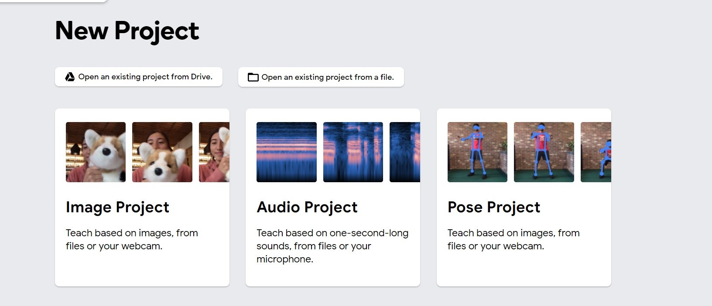
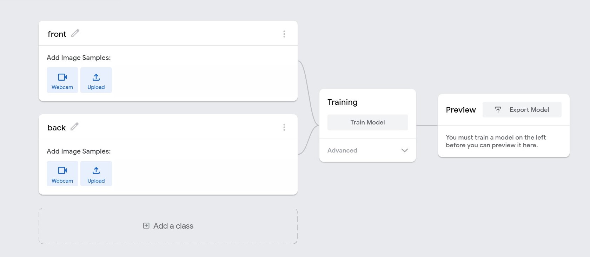
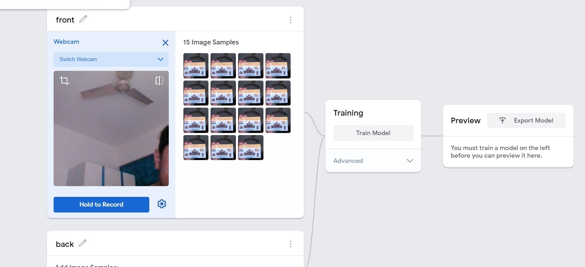
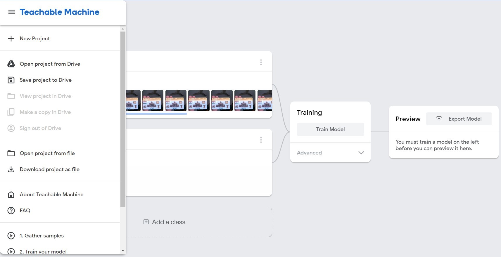

# Teachable machines guide.
1. Head to **[Teachable machines website](https://teachablemachine.withgoogle.com/train)**.
2. Select image project option.

3. You will find 2 classes already added. Rename these to back and front.

4. Click on the webcam option and press record to capture images of the document. (Around 15 images for both sides)

5. Cick on the menu in the top left and select **Download project as a file**.

6. Share the downloaded file.
