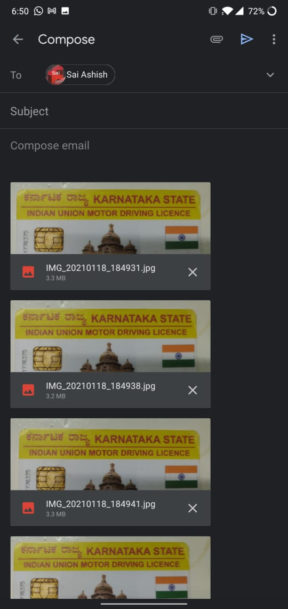

# Guide to gather dataset.

1. Open the camera app on the phone.

2. Take a picture of the id card such that it is clearly visible in frame.
   
   
   &nbsp;
3. Take around 5-10 images of both the back and front of the id card.
4. Select the images that you have click from the gallery app and click share.

&nbsp;

5. Select gmail and email the images to saiashish90@gmail.com

